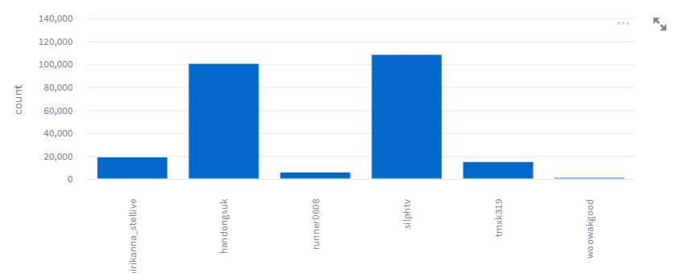
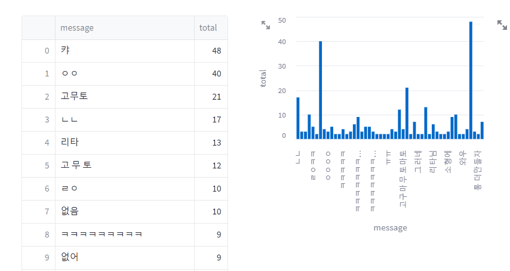

[](https://github.com/psf/black)
[](https://pycqa.github.io/isort/)


# streamingchat


실시간 채팅 수집기 및 분석

---

1. 방송 플랫폼(트위치, 유튜브 등) 채팅을 실시간으로 수집한다. (web driver)
   1. 너무 많은 채팅이 올라올경우, 웹드라이버로는 수집하지못하는 이슈 발생. (API도 고려중)
2. kafka 관련 데이터 처리
   1. 1회만 정확하게 전송
      1. 일부러 예외를 발생시켜서 관련 확인 
   2. 중복을 허용하는 전송
   3. 순서를 보장하는 적재
      1. Key를 지정하여 적재
      2. 순서를 보장하는 프로듀서 사용
3. 데이터 시각화 툴을 이용하여 배치성으로 데이터를 시각화 한다
4. 랜덤으로 로그 생성해서 관련 처리.


## DASAHBOARD

```
streamlit run .\dashboard\app.py
주소 : http://localhost:8501/ 
```

#### 채널별 채팅 수


### 가장 많이 나온 단어


---
## TODO
- [x] 트위치 채팅 수집기 개발
- [x] 총 채팅 수
- [x] 가장 많이 채팅 한 사람
- [x] 가장 많이 나온 단어
- [ ] helm chart로 infra 변경
- [ ] 명령어 관련 sh 파일 작성
- [ ] kafka 한번만 정확히 전송 (acks = all)
- [ ] kafka 모니터링 (그라파나, 프로메테우스)
- [ ] 컨슈머 쪽에서 중복 제거 하는 로직
- [ ] 카프카 메시지 순서 보장
  - 토픽에 하나의 파티션
  - 하나의 컨슈머만 존재
  - Key를 지정하여 전송
- [ ] schema registry를 이용한 테스트
  - 스키마 변경 (SCHEMA_REGISTRY_SCHEMA_COMPATIBILITY_LEVEL)
- [ ] Kafka SMT 적용하기
---

